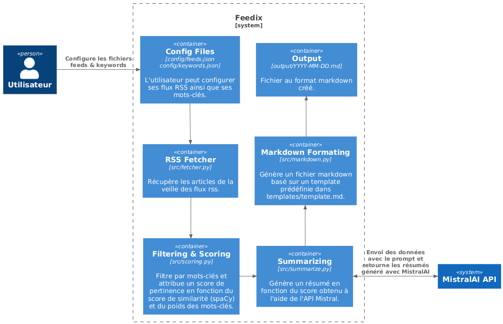

# Architecture Technique - Feedix MVP

## Vue d'Ensemble


[Version PlantUML](./assets/diagram_c4.puml)

## Composants Principaux

### 1. RSS Fetcher
- **Technologie**: `feedparser` (Python)
- **Fonction**: Récupère les flux RSS depuis une liste d'URLs
- **Sortie**: Liste d'articles bruts (titre, URL, contenu, date)

### 2. Keyword Filter
- **Technologie**: `spaCy` (Python)
- **Fonction**:
  - Filtrage par mots-clés exacts (case-insensitive)
  - Calcul de score de pertinence basique
- **Sortie**: Articles filtrés avec score

### 3. Mistral API Integration
- **Technologie**: `requests` + API Mistral
- **Fonction**:
  - Envoi des articles pertinents à l'API
  - Récupération des résumés générés
- **Modèle**: Utilisation du modèle par défaut de Mistral

### 4. Markdown Generator
- **Technologie**: `Jinja2` templates
- **Fonction**:
  - Génération d'un fichier Markdown structuré
  - Formatage des articles avec métadonnées
- **Sortie**: `output/YYYY-MM-DD-report.md`


```

## Configuration

### Fichiers de Configuration
- `config/feeds.json`: Liste des URLs RSS à surveiller
- `config/keywords.json`: Liste des mots-clés avec un poids attribué à chacun
- `.env`: Variables d'environnement (clé API Mistral)


```

## Choix Techniques

1. **Python + uv**: Gestion légère des dépendances
2. **feedparser**: Bibliothèque mature et simple pour RSS
3. **Mistral API**: Solution IA moderne et open-source
4. **Markdown**: Format universel et facile à générer
5. **Jinja2**: Templating simple pour la génération de rapports
6. **spaCy**: Génération d'un score de similarité.

## Performances Attendues

- Temps d'exécution: < 2min pour 10 flux RSS
- Taille moyenne du rapport: 5-10 articles pertinents
- Fréquence d'exécution: 1x/jour (cron ou manuel)
